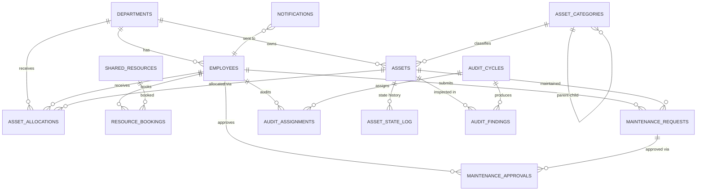
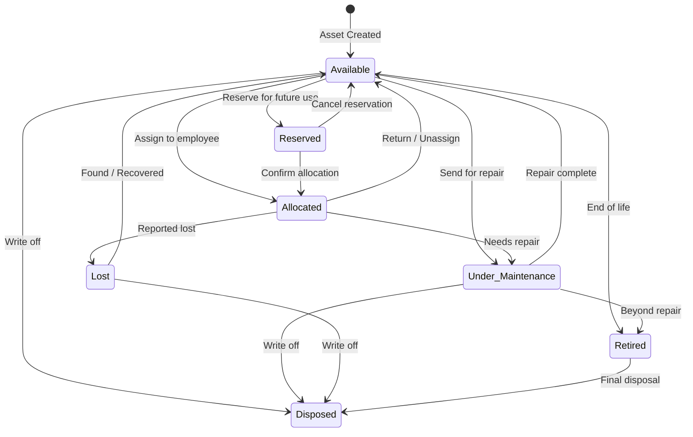
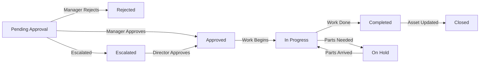

# Enterprise Asset & Resource Management System — Database Design Guide

## Overview

This document lays out the complete SQLite database schema, entity relationships, and Python project structure to get you started. The design is normalized (3NF) with strategic denormalization for dashboard KPIs.

---

## Entity-Relationship Diagram



---

## Domain 1 — Organizational Structure

### `departments`

| Column | Type | Constraints | Description |
|--------|------|-------------|-------------|
| `id` | INTEGER | PRIMARY KEY AUTOINCREMENT | Unique department ID |
| `name` | TEXT | NOT NULL, UNIQUE | Department name |
| `code` | TEXT | NOT NULL, UNIQUE | Short code (e.g., `ENG`, `HR`) |
| `parent_id` | INTEGER | FK → departments(id), NULLABLE | For hierarchical org structure |
| `head_employee_id` | INTEGER | FK → employees(id), NULLABLE | Department head |
| `created_at` | TEXT | DEFAULT CURRENT_TIMESTAMP | |
| `is_active` | INTEGER | DEFAULT 1 | Soft delete flag |

### `employees`

| Column | Type | Constraints | Description |
|--------|------|-------------|-------------|
| `id` | INTEGER | PRIMARY KEY AUTOINCREMENT | |
| `employee_code` | TEXT | NOT NULL, UNIQUE | e.g., `EMP-0042` |
| `first_name` | TEXT | NOT NULL | |
| `last_name` | TEXT | NOT NULL | |
| `email` | TEXT | NOT NULL, UNIQUE | |
| `phone` | TEXT | | |
| `department_id` | INTEGER | FK → departments(id) | |
| `designation` | TEXT | | Job title |
| `role` | TEXT | DEFAULT 'employee' | `admin`, `manager`, `employee`, `auditor` |
| `date_joined` | TEXT | NOT NULL | |
| `is_active` | INTEGER | DEFAULT 1 | |
| `created_at` | TEXT | DEFAULT CURRENT_TIMESTAMP | |

### `asset_categories`

| Column | Type | Constraints | Description |
|--------|------|-------------|-------------|
| `id` | INTEGER | PRIMARY KEY AUTOINCREMENT | |
| `name` | TEXT | NOT NULL, UNIQUE | e.g., `Laptops`, `Vehicles` |
| `parent_id` | INTEGER | FK → asset_categories(id), NULLABLE | Hierarchical categories |
| `description` | TEXT | | |
| `depreciation_rate` | REAL | DEFAULT 0.0 | Annual depreciation % |
| `created_at` | TEXT | DEFAULT CURRENT_TIMESTAMP | |

---

## Domain 2 — Assets & Lifecycle

### `assets`

| Column | Type | Constraints | Description |
|--------|------|-------------|-------------|
| `id` | INTEGER | PRIMARY KEY AUTOINCREMENT | |
| `asset_tag` | TEXT | NOT NULL, UNIQUE | e.g., `AST-2026-00123` |
| `name` | TEXT | NOT NULL | e.g., "Dell Latitude 5540" |
| `category_id` | INTEGER | FK → asset_categories(id) | |
| `department_id` | INTEGER | FK → departments(id), NULLABLE | Owning department |
| `serial_number` | TEXT | UNIQUE, NULLABLE | Manufacturer serial |
| `model` | TEXT | | |
| `manufacturer` | TEXT | | |
| `purchase_date` | TEXT | | |
| `purchase_cost` | REAL | | |
| `warranty_expiry` | TEXT | | |
| `current_state` | TEXT | NOT NULL, DEFAULT 'Available' | Current lifecycle state |
| `location` | TEXT | | Physical location / room |
| `notes` | TEXT | | |
| `created_at` | TEXT | DEFAULT CURRENT_TIMESTAMP | |
| `updated_at` | TEXT | DEFAULT CURRENT_TIMESTAMP | |

> [!IMPORTANT]
> `current_state` must be one of: `Available`, `Allocated`, `Reserved`, `Under Maintenance`, `Lost`, `Retired`, `Disposed`. Enforce this with a CHECK constraint.

### `asset_state_log` (State Transition History)

| Column | Type | Constraints | Description |
|--------|------|-------------|-------------|
| `id` | INTEGER | PRIMARY KEY AUTOINCREMENT | |
| `asset_id` | INTEGER | FK → assets(id), NOT NULL | |
| `from_state` | TEXT | NULLABLE | NULL for initial creation |
| `to_state` | TEXT | NOT NULL | New state |
| `changed_by` | INTEGER | FK → employees(id) | Who triggered the change |
| `reason` | TEXT | | Why the transition happened |
| `changed_at` | TEXT | DEFAULT CURRENT_TIMESTAMP | |

### State Machine — Valid Transitions



> [!TIP]
> Store the valid transitions in a Python dictionary or a `valid_transitions` table so you can validate programmatically before allowing any state change.

```python
# Example: In-code transition validation
VALID_TRANSITIONS = {
    "Available":         ["Allocated", "Reserved", "Under Maintenance", "Retired", "Disposed"],
    "Allocated":         ["Available", "Under Maintenance", "Lost"],
    "Reserved":          ["Available", "Allocated"],
    "Under Maintenance": ["Available", "Retired", "Disposed"],
    "Lost":              ["Available", "Disposed"],
    "Retired":           ["Disposed"],
    "Disposed":          [],  # Terminal state
}
```

---

## Domain 3 — Asset Allocation (Anti-Double-Allocation)

### `asset_allocations`

| Column | Type | Constraints | Description |
|--------|------|-------------|-------------|
| `id` | INTEGER | PRIMARY KEY AUTOINCREMENT | |
| `asset_id` | INTEGER | FK → assets(id), NOT NULL | |
| `employee_id` | INTEGER | FK → employees(id), NULLABLE | Individual allocation |
| `department_id` | INTEGER | FK → departments(id), NULLABLE | Department-level allocation |
| `allocated_by` | INTEGER | FK → employees(id) | Who performed the allocation |
| `allocated_at` | TEXT | DEFAULT CURRENT_TIMESTAMP | |
| `expected_return` | TEXT | NULLABLE | Due date for return |
| `returned_at` | TEXT | NULLABLE | NULL = currently allocated |
| `notes` | TEXT | | |

> [!CAUTION]
> **Preventing Double-Allocation**: Use a **partial unique index** on `asset_id` where `returned_at IS NULL`. This ensures only ONE active allocation per asset at the database level.

```sql
CREATE UNIQUE INDEX idx_single_active_allocation
ON asset_allocations(asset_id)
WHERE returned_at IS NULL;
```

---

## Domain 4 — Resource Booking (Time-Slot Overlap Validation)

### `shared_resources`

| Column | Type | Constraints | Description |
|--------|------|-------------|-------------|
| `id` | INTEGER | PRIMARY KEY AUTOINCREMENT | |
| `name` | TEXT | NOT NULL | e.g., "Conference Room A", "Projector #3" |
| `resource_type` | TEXT | NOT NULL | `room`, `equipment`, `vehicle` |
| `capacity` | INTEGER | DEFAULT 1 | Max simultaneous bookings (1 = exclusive) |
| `location` | TEXT | | |
| `is_active` | INTEGER | DEFAULT 1 | |
| `created_at` | TEXT | DEFAULT CURRENT_TIMESTAMP | |

### `resource_bookings`

| Column | Type | Constraints | Description |
|--------|------|-------------|-------------|
| `id` | INTEGER | PRIMARY KEY AUTOINCREMENT | |
| `resource_id` | INTEGER | FK → shared_resources(id) | |
| `booked_by` | INTEGER | FK → employees(id) | |
| `start_time` | TEXT | NOT NULL | ISO 8601 datetime |
| `end_time` | TEXT | NOT NULL | ISO 8601 datetime |
| `purpose` | TEXT | | |
| `status` | TEXT | DEFAULT 'Confirmed' | `Confirmed`, `Cancelled`, `Completed` |
| `created_at` | TEXT | DEFAULT CURRENT_TIMESTAMP | |

> [!IMPORTANT]
> **Overlap Validation Query** — Run this check BEFORE inserting a new booking:

```sql
-- Check if a conflicting booking exists
SELECT COUNT(*) FROM resource_bookings
WHERE resource_id = ?
  AND status = 'Confirmed'
  AND start_time < ?   -- new_end_time
  AND end_time   > ?;  -- new_start_time

-- If COUNT >= capacity of the resource, REJECT the booking.
```

---

## Domain 5 — Maintenance Workflow (Approval Routing)

### `maintenance_requests`

| Column | Type | Constraints | Description |
|--------|------|-------------|-------------|
| `id` | INTEGER | PRIMARY KEY AUTOINCREMENT | |
| `request_code` | TEXT | NOT NULL, UNIQUE | e.g., `MR-2026-0001` |
| `asset_id` | INTEGER | FK → assets(id) | |
| `requested_by` | INTEGER | FK → employees(id) | |
| `issue_description` | TEXT | NOT NULL | |
| `priority` | TEXT | DEFAULT 'Medium' | `Low`, `Medium`, `High`, `Critical` |
| `status` | TEXT | DEFAULT 'Pending Approval' | See workflow below |
| `estimated_cost` | REAL | | |
| `actual_cost` | REAL | | Filled after completion |
| `submitted_at` | TEXT | DEFAULT CURRENT_TIMESTAMP | |
| `resolved_at` | TEXT | NULLABLE | |

### `maintenance_approvals`

| Column | Type | Constraints | Description |
|--------|------|-------------|-------------|
| `id` | INTEGER | PRIMARY KEY AUTOINCREMENT | |
| `request_id` | INTEGER | FK → maintenance_requests(id) | |
| `approver_id` | INTEGER | FK → employees(id) | |
| `decision` | TEXT | NOT NULL | `Approved`, `Rejected`, `Escalated` |
| `comments` | TEXT | | |
| `decided_at` | TEXT | DEFAULT CURRENT_TIMESTAMP | |
| `approval_level` | INTEGER | DEFAULT 1 | For multi-level approval chains |

### Maintenance Workflow



---

## Domain 6 — Audit Cycles & Discrepancy Reports

### `audit_cycles`

| Column | Type | Constraints | Description |
|--------|------|-------------|-------------|
| `id` | INTEGER | PRIMARY KEY AUTOINCREMENT | |
| `cycle_name` | TEXT | NOT NULL | e.g., "Q3 2026 Audit" |
| `start_date` | TEXT | NOT NULL | |
| `end_date` | TEXT | NOT NULL | |
| `status` | TEXT | DEFAULT 'Planned' | `Planned`, `In Progress`, `Completed` |
| `created_by` | INTEGER | FK → employees(id) | |
| `created_at` | TEXT | DEFAULT CURRENT_TIMESTAMP | |

### `audit_assignments`

| Column | Type | Constraints | Description |
|--------|------|-------------|-------------|
| `id` | INTEGER | PRIMARY KEY AUTOINCREMENT | |
| `audit_cycle_id` | INTEGER | FK → audit_cycles(id) | |
| `auditor_id` | INTEGER | FK → employees(id) | |
| `department_id` | INTEGER | FK → departments(id), NULLABLE | Scope: audit this dept |
| `category_id` | INTEGER | FK → asset_categories(id), NULLABLE | Scope: audit this category |
| `status` | TEXT | DEFAULT 'Assigned' | `Assigned`, `In Progress`, `Completed` |

### `audit_findings`

| Column | Type | Constraints | Description |
|--------|------|-------------|-------------|
| `id` | INTEGER | PRIMARY KEY AUTOINCREMENT | |
| `audit_cycle_id` | INTEGER | FK → audit_cycles(id) | |
| `asset_id` | INTEGER | FK → assets(id) | |
| `auditor_id` | INTEGER | FK → employees(id) | |
| `expected_state` | TEXT | | What the system says |
| `actual_state` | TEXT | | What the auditor found |
| `expected_location` | TEXT | | |
| `actual_location` | TEXT | | |
| `discrepancy_type` | TEXT | NULLABLE | `State Mismatch`, `Location Mismatch`, `Missing`, `Condition Issue` |
| `notes` | TEXT | | |
| `found_at` | TEXT | DEFAULT CURRENT_TIMESTAMP | |

> [!TIP]
> **Auto-generating discrepancy reports**: When an auditor submits a finding, compare `expected_state` vs `actual_state` and `expected_location` vs `actual_location`. If they differ, auto-populate the `discrepancy_type` field.

---

## Domain 7 — Notifications & KPI Dashboard

### `notifications`

| Column | Type | Constraints | Description |
|--------|------|-------------|-------------|
| `id` | INTEGER | PRIMARY KEY AUTOINCREMENT | |
| `recipient_id` | INTEGER | FK → employees(id) | |
| `type` | TEXT | NOT NULL | `overdue_return`, `booking_reminder`, `maintenance_update`, `audit_assigned`, `approval_needed` |
| `title` | TEXT | NOT NULL | |
| `message` | TEXT | NOT NULL | |
| `reference_type` | TEXT | | e.g., `allocation`, `booking`, `maintenance` |
| `reference_id` | INTEGER | | ID of the related record |
| `is_read` | INTEGER | DEFAULT 0 | |
| `created_at` | TEXT | DEFAULT CURRENT_TIMESTAMP | |

### KPI Dashboard Queries (No Extra Table Needed)

These are **computed views** you can query on-the-fly or cache periodically:

```sql
-- 1. Assets by State
SELECT current_state, COUNT(*) as count FROM assets GROUP BY current_state;

-- 2. Overdue Returns
SELECT a.*, e.first_name, e.last_name
FROM asset_allocations a
JOIN employees e ON a.employee_id = e.id
WHERE a.returned_at IS NULL
  AND a.expected_return < date('now');

-- 3. Upcoming Bookings (next 7 days)
SELECT * FROM resource_bookings
WHERE start_time BETWEEN datetime('now') AND datetime('now', '+7 days')
  AND status = 'Confirmed';

-- 4. Open Maintenance Requests by Priority
SELECT priority, COUNT(*) FROM maintenance_requests
WHERE status NOT IN ('Completed', 'Closed', 'Rejected')
GROUP BY priority;

-- 5. Audit Discrepancies Summary
SELECT discrepancy_type, COUNT(*) FROM audit_findings
WHERE discrepancy_type IS NOT NULL
GROUP BY discrepancy_type;

-- 6. Department Asset Value
SELECT d.name, SUM(a.purchase_cost) as total_value, COUNT(*) as asset_count
FROM assets a
JOIN departments d ON a.department_id = d.id
GROUP BY d.name;
```

---

## Indexing Strategy

```sql
-- Performance-critical indexes
CREATE INDEX idx_assets_state ON assets(current_state);
CREATE INDEX idx_assets_category ON assets(category_id);
CREATE INDEX idx_assets_department ON assets(department_id);

CREATE INDEX idx_allocations_asset ON asset_allocations(asset_id);
CREATE INDEX idx_allocations_employee ON asset_allocations(employee_id);
CREATE INDEX idx_allocations_active ON asset_allocations(asset_id) WHERE returned_at IS NULL;

CREATE INDEX idx_bookings_resource_time ON resource_bookings(resource_id, start_time, end_time);
CREATE INDEX idx_bookings_status ON resource_bookings(status);

CREATE INDEX idx_maintenance_status ON maintenance_requests(status);
CREATE INDEX idx_maintenance_asset ON maintenance_requests(asset_id);

CREATE INDEX idx_notifications_recipient ON notifications(recipient_id, is_read);

CREATE INDEX idx_state_log_asset ON asset_state_log(asset_id);
```

---

## Recommended Python Project Structure

```
Hackathon/
├── database/
│   ├── __init__.py
│   ├── connection.py          # SQLite connection manager
│   ├── schema.py              # CREATE TABLE statements & migrations
│   └── seed.py                # Sample data for testing
├── models/
│   ├── __init__.py
│   ├── department.py          # Department CRUD
│   ├── employee.py            # Employee CRUD
│   ├── asset.py               # Asset CRUD + state machine logic
│   ├── allocation.py          # Allocation + double-alloc prevention
│   ├── booking.py             # Booking + overlap validation
│   ├── maintenance.py         # Maintenance + approval workflow
│   ├── audit.py               # Audit cycles + discrepancy detection
│   └── notification.py        # Notification generation
├── services/
│   ├── __init__.py
│   ├── asset_lifecycle.py     # State transition orchestration
│   ├── booking_service.py     # Overlap checking logic
│   ├── approval_engine.py     # Multi-level approval routing
│   ├── audit_runner.py        # Scheduled audit + report generation
│   └── notification_service.py# Overdue checks + alert dispatching
├── utils/
│   ├── __init__.py
│   ├── validators.py          # Input validation helpers
│   └── code_generator.py      # Generate AST-2026-XXXXX codes
├── app.py                     # Entry point (CLI or Flask/FastAPI)
├── config.py                  # DB path, settings
└── requirements.txt
```

---

## Step-by-Step Getting Started Plan

### Step 1: Set Up the Database Layer
1. Create `database/connection.py` — a singleton connection manager with `WAL` mode enabled
2. Create `database/schema.py` — all `CREATE TABLE` statements with foreign keys and constraints
3. Run the schema to initialize `enterprise_assets.db`

### Step 2: Build Core Models (CRUD)
4. Implement `models/department.py`, `employee.py`, `asset_category.py` — basic CRUD
5. Implement `models/asset.py` — CRUD + state validation using `VALID_TRANSITIONS`

### Step 3: Implement Business Logic
6. **Allocation** — write allocation logic with the partial unique index guard
7. **Booking** — implement overlap validation query before inserts
8. **Maintenance** — approval chain logic (check role → route to manager → approve/reject)

### Step 4: Audit Engine
9. Create audit cycles, auto-assign auditors, compare expected vs actual

### Step 5: Notifications & Dashboard
10. Scheduled job (or manual trigger) to scan for overdue returns, pending approvals
11. Build KPI queries for the dashboard

### Step 6: Wire Up the UI/API
12. Add Flask/FastAPI routes or a CLI interface on top

---

## Key Design Decisions

| Decision | Rationale |
|----------|-----------|
| **ISO 8601 strings for dates** | SQLite lacks a native date type; ISO strings sort correctly and work with `date()` / `datetime()` functions |
| **Soft deletes (`is_active`)** | Assets and employees are never hard-deleted to preserve audit trails |
| **Partial unique index** for allocations | Database-level enforcement of single active allocation — no race conditions |
| **State log table** | Full audit trail of every state change, who did it, and why |
| **Hierarchical categories & departments** | `parent_id` self-referencing FK enables tree structures without extra tables |
| **Separate approval table** | Supports multi-level approval chains and full decision history |
