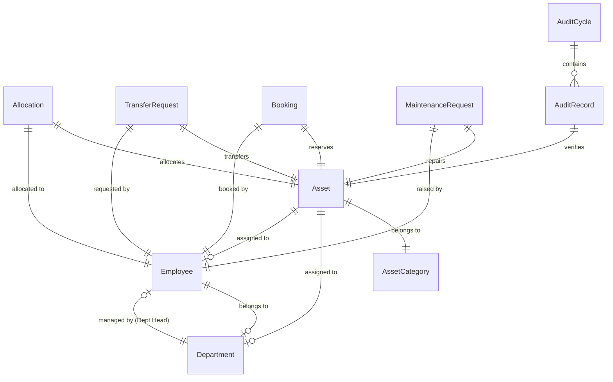

# 🗺️ AssetFlow — Full-Stack Architecture & Implementation Roadmap

This document outlines the database schema, API design, and step-by-step development roadmap for building the **AssetFlow** application using a **React Frontend**, **Node.js/Express Backend**, and **SQLite Database**.

---

## 🏗️ Technology Stack

* **Frontend**: React (Vite), TypeScript, Vanilla CSS, Lucide Icons.
* **Backend**: Node.js, Express, TypeScript (or JavaScript).
* **Database & ORM**: **SQLite** (stored in a single file `database.db`) + **Prisma ORM** (simplifies database design, migrations, and relationships).

---

## 💾 Database Schema (SQLite / Prisma)

Here are the key tables and relationships required to handle all project requirements:

### Table Details

1. **`Employee`** (User Accounts)
   - `id` (UUID / Integer, PK)
   - `name` (String)
   - `email` (String, Unique)
   - `passwordHash` (String)
   - `role` (Enum: `Admin`, `AssetManager`, `DepartmentHead`, `Employee`)
   - `status` (Enum: `Active`, `Inactive`)
   - `departmentId` (FK, Nullable)

2. **`Department`**
   - `id` (PK)
   - `name` (String)
   - `status` (Enum: `Active`, `Inactive`)
   - `managerId` (FK to Employee, Nullable) — *Department Head*
   - `parentId` (FK to Department, Nullable) — *For organizational hierarchy*

3. **`AssetCategory`**
   - `id` (PK)
   - `name` (String) — *e.g., Electronics, Vehicles, Furniture*
   - `customFields` (JSON String) — *Stores category-specific attributes like warranty periods or license plates*

4. **`Asset`**
   - `id` (PK)
   - `name` (String)
   - `tag` (String, Unique) — *Auto-generated: e.g., AF-0001*
   - `serialNumber` (String, Unique)
   - `acquisitionDate` (Date)
   - `acquisitionCost` (Decimal)
   - `condition` (String)
   - `location` (String)
   - `isBookable` (Boolean) — *Flag for shared resources*
   - `categoryId` (FK to AssetCategory)
   - `status` (Enum: `Available`, `Allocated`, `Reserved`, `UnderMaintenance`, `Lost`, `Retired`, `Disposed`)

5. **`Allocation`** (Tracks who holds what)
   - `id` (PK)
   - `assetId` (FK to Asset)
   - `employeeId` (FK to Employee, Nullable)
   - `departmentId` (FK to Department, Nullable)
   - `checkoutDate` (Date)
   - `expectedReturnDate` (Date, Nullable)
   - `actualReturnDate` (Date, Nullable)
   - `checkoutNotes` (String)
   - `returnNotes` (String, Nullable)

6. **`TransferRequest`** (Asset handover between employees)
   - `id` (PK)
   - `assetId` (FK to Asset)
   - `requesterId` (FK to Employee) — *Who wants it*
   - `currentHolderId` (FK to Employee) — *Who has it now*
   - `status` (Enum: `Pending`, `Approved`, `Rejected`)

7. **`Booking`** (Time-slot reservations for rooms/vehicles)
   - `id` (PK)
   - `assetId` (FK to Asset)
   - `employeeId` (FK to Employee)
   - `startTime` (DateTime)
   - `endTime` (DateTime)
   - `status` (Enum: `Upcoming`, `Ongoing`, `Completed`, `Cancelled`)

8. **`MaintenanceRequest`** (Asset Repair Flow)
   - `id` (PK)
   - `assetId` (FK to Asset)
   - `reporterId` (FK to Employee)
   - `description` (String)
   - `priority` (Enum: `Low`, `Medium`, `High`)
   - `technician` (String, Nullable)
   - `status` (Enum: `Pending`, `Approved`, `Rejected`, `InProgress`, `Resolved`)

9. **`AuditCycle` & `AuditRecord`** (Verification)
   - **`AuditCycle`**: `id`, `name`, `scopeDepartmentId`, `scopeLocation`, `startDate`, `endDate`, `status` (`Open`, `Closed`)
   - **`AuditRecord`**: `id`, `auditCycleId` (FK), `assetId` (FK), `auditorId` (FK), `status` (`Verified`, `Missing`, `Damaged`), `notes`

10. **`ActivityLog`** (Audit Trail)
    - `id` (PK), `employeeId` (FK), `action` (String), `timestamp` (DateTime)

---

## 🗺️ Step-by-Step Roadmap (Timeline)

### Phase 1: Environment & Backend Setup (Hours 1 - 2)
1. **Initialize Project Folders**: Split repository into `frontend/` (React SPA) and `backend/` (Node Express Server).
2. **Setup SQLite & Prisma**: Define schemas in Prisma, run `prisma db push` to generate the SQLite database.
3. **Seed Data Script**: Write a seed script to auto-generate:
   - 1 Admin account.
   - 2 Department Heads.
   - 5 standard Employees.
   - 3 Departments.
   - Default Asset Categories.

### Phase 2: Authentication & Org Setup (Hours 2 - 3)
1. **API Endpoints**: `/api/auth/signup`, `/api/auth/login`.
2. **Tab Interface (Admin Only)**:
   - **Department Management Screen**: CRUD operations.
   - **Category Custom Fields Screen**: Configure category schema.
   - **Employee Promotion Screen**: Promote standard employees to Department Head / Asset Manager.

### Phase 3: Asset Register & Lifecycle (Hours 3 - 4)
1. **Asset CRUD APIs**: `/api/assets` (register, list, search, filter).
2. **Asset Directory UI**: Clean search grid with status tags (`Available`, `Allocated`, etc.) and history log popups.

### Phase 4: Allocations & Transfers (Conflict-Prevention) (Hours 4 - 5)
1. **Allocation API (`/api/allocations`)**:
   - Checks if asset status is `Available`.
   - If not, blocks allocation, returns current holder's name, and offers a **Transfer Request** instead.
2. **Transfer Approval Dashboard**: Asset Manager and Dept Head screens to Approve/Reject pending transfer requests.

### Phase 5: Resource Booking with Overlap Check (Hours 5 - 6)
1. **Booking API (`/api/bookings`)**:
   - **Overlap Validator**: Queries existing bookings for the same `assetId` where `(requestedStart < dbEnd) AND (requestedEnd > dbStart)`.
   - Rejects the request if overlaps are found.
2. **Calendar Booking UI**: Quick date-time selector and reservation calendar.

### Phase 6: Maintenance & Audits (Hours 6 - 7)
1. **Maintenance Flow**: Employee raises a request ➔ Manager Approves (flips asset state to `Under Maintenance`) ➔ Technician resolves (flips asset state back to `Available`).
2. **Audit Cycles**: Create cycle ➔ Auditor marks assets as `Verified`/`Missing`/`Damaged` ➔ Lock cycle (automatically changes missing assets to `Lost`).

### Phase 7: Analytics Dashboard & Wrap-up (Hours 7 - 8)
1. **KPI Dashboard**: Cards showing totals, overdue returns list, utilization charts, and activity logs feed.
2. **Final Testing & Video Recording**: Ensure everything works, record the 5-minute demo video covering the functional flow, and commit the latest code to `main`.
